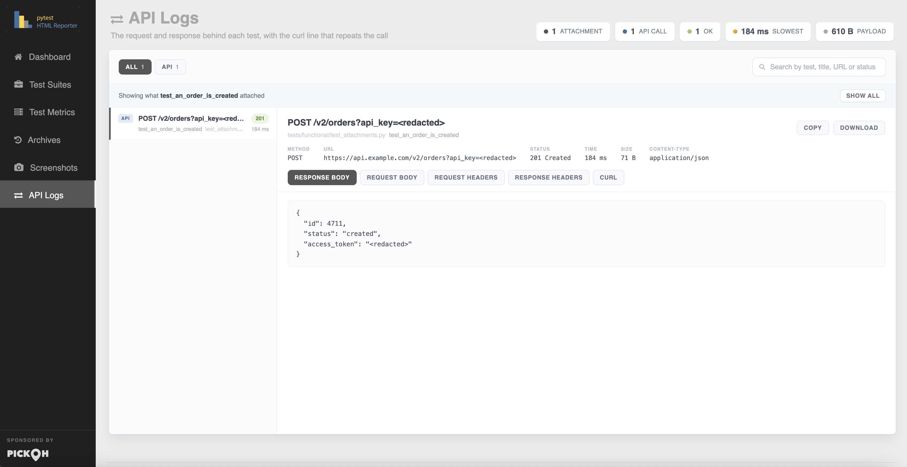
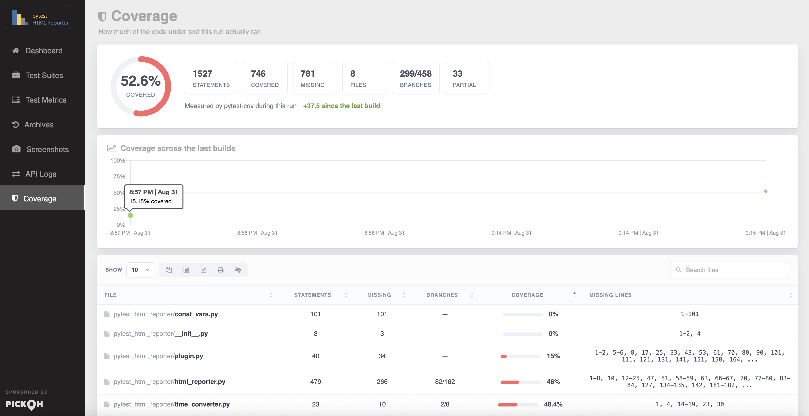
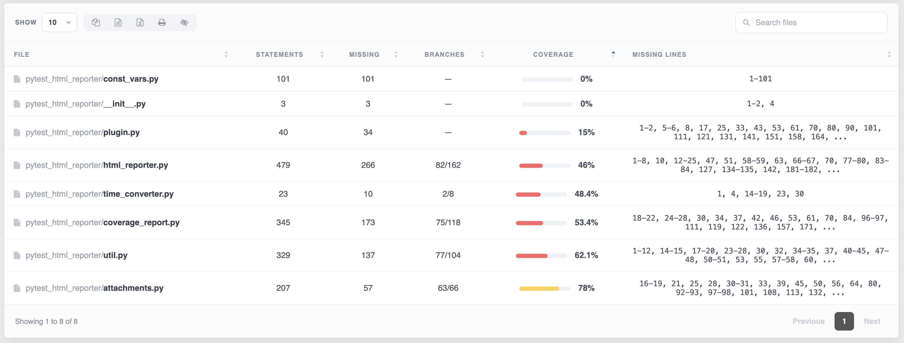
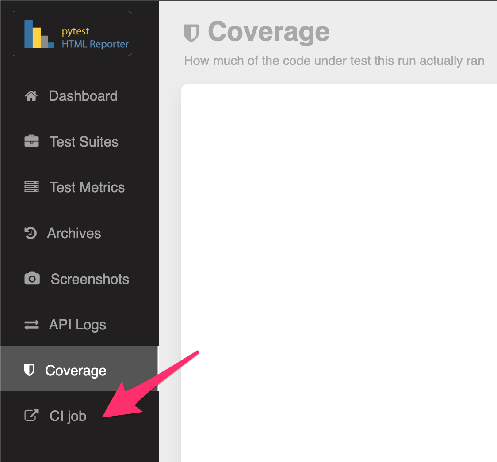

=====================
pytest-html-reporter
=====================

.. image:: https://badges.gitter.im/prashanth-sams/pytest-html-reporter.svg
   :alt: Join the chat at https://gitter.im/prashanth-sams/pytest-html-reporter
   :target: https://gitter.im/prashanth-sams/pytest-html-reporter?utm_source=badge&utm_medium=badge&utm_campaign=pr-badge&utm_content=badge

.. image:: https://badge.fury.io/py/pytest-html-reporter.svg?v=0.4.1
    :target: https://badge.fury.io/py/pytest-html-reporter
    :alt: PyPI version

.. image:: https://coveralls.io/repos/github/prashanth-sams/pytest-html-reporter/badge.svg?branch=0.4.1
    :target: https://coveralls.io/github/prashanth-sams/pytest-html-reporter?branch=0.4.1

.. image:: https://pepy.tech/badge/pytest-html-reporter
    :target: https://pepy.tech/project/pytest-html-reporter
    :alt: Downloads

..

        Generates a light-weight static html report based on ``pytest`` framework

.. image:: https://i.imgur.com/4TYia5j.png
   :alt: pytest-html-reporter

Features
------------
* Generic information

  - Overview
  - Environment
  - Trends
  - Highlights - the most failed suite, and the failure delta since the last build
  - Test suite details
* Analytics - flaky tests, standing failures, failures grouped by exception, pass-rate drift and where the run's time goes, read across every archived build
* Test Steps - the named, timed pieces a test is made of, nested, drilling down from the suite to the test to what it did; ``async`` suites included, where work run concurrently comes back as the siblings it was
* Cucumber / Gherkin - ``pytest-bdd`` scenarios need no changes at all: their Given / When / Then arrive as steps on their own, each timed and carrying what its parser pulled out of the line, with the feature, the scenario and its tags named alongside
* Markers in full - including a module-level ``pytestmark``, one on the class, and one added while the test ran, each saying which scope it came from
* Archives / History
* Screenshots - a failing Selenium or Playwright test is photographed automatically, with no hook, fixture or import; ``attach`` still takes an image of your own, from anything that can produce a PNG.
* Attachments - Logs API events/calls, JSON and free text kept against the test that produced them
* Captured logs per test (stdout, stderr and ``logging``)
* Test Coverage - the percentage, the split by file and the trend across builds, read from whatever measured it
* Deep links - every test row has an address of its own, copied from a button beside the failure, opening the report on that row whatever page of the table it has ended up on
* Light and dark themes - a switch at the foot of the side nav, remembered per reader, following the operating system until it is touched
* Custom side-nav links to any page of your own
* Opens the finished report in a browser on a local run, and stays quiet on a build agent
* Test Rerun support
* Parallel run support (``pytest-xdist``)
* Sharded and cross-machine runs - a matrix that splits the suite over four machines, or three legs run one after another, are merged into one build by ``pytest-html-reporter merge``: one set of totals, one archived build, one JUnit XML
* Dedicated GitHub Action

Installation
------------

.. code-block:: console

    $ pip3 install pytest-html-reporter

Usage
------------

By default, the filename used is ``pytest_html_reporter.html`` and path chosen is ``report``; you can skip both or
either one of them if not needed::

    $ pytest tests/

..

        Custom path, filename, and title

Add ``--html-report`` tag followed by path location and filename to customize the report location and filename::

    $ pytest tests/ --html-report=./report
    $ pytest tests/ --html-report=./report/report.html

The path is run through ``strftime``, so date and time placeholders (``%Y``, ``%m``, ``%d``, ``%H``, ``%M``, ...) give
each run a folder or a filename of its own::

    $ pytest tests/ --html-report=./reports/%Y%m%d/report_%H%M.html

They are expanded once, when the run starts, so a parallel run and a run that crosses a minute boundary still write a
single report. Write ``%%`` for a literal percent sign in front of a letter; a ``%`` that is not a placeholder, as in
``100% pass``, is left as it is.

Add ``--title`` tag followed by the report title; it is capped at 20 characters and the cut tail fades out, with the
full title kept as the heading's tooltip::

    $ pytest tests/ --html-report=./report --title='PYTEST REPORT'

Add ``--archive-count`` tag followed by an integer to limit showing the number of builds in the ``Archives`` section::

    $ pytest tests/ --archive-count 7
    $ pytest tests/ --html-report=./report --archive-count 7

A run on a schedule usually wants a stretch of time rather than a build count. ``--archive-days`` keeps only the
builds from the last N days and deletes the rest, and needs no retuning when the schedule changes::

    $ pytest tests/ --archive-days 30
    $ pytest tests/ --archive-days 0.5

``--archive-since`` takes a date instead - or a date and a time - for a one-off cut; everything older than it goes::

    $ pytest tests/ --archive-since 2026-06-01
    $ pytest tests/ --archive-since '2026-06-01 09:00'

The three limits intersect: a build has to satisfy every one you set to be kept. Set none of them and every build is
kept for ever, which is what eventually makes a report slow to open - a retained build costs roughly 5KB of the page,
so an hourly run reaches a multi-megabyte report inside a couple of months.

A build is dated by the moment its run started, which is kept in the name of its archive file, so an age limit still
measures the right thing after the reports have been copied into a fresh CI workspace.

..

        Opening the report

When the run finishes, the report is opened in your browser. Nothing is needed to get this - it is what the command you
already run now does::

    $ pytest tests/ --html-report=./report

It only happens on a run somebody is sat in front of. Three things all have to be true, and a build agent fails every
one of them:

=========================================  ===========================================================
Checked                                    Why
=========================================  ===========================================================
The run's output is a terminal             Output piped into a file or a log collector - ``cron``,
                                           ``nohup``, a build system nobody has heard of - means
                                           nobody is watching it go past
No CI variable is set                      ``CI``, ``GITHUB_ACTIONS``, ``JENKINS_URL`` and the rest of
                                           the usual set; ``CI=false`` counts as "not CI"
There is a desktop to open into            ``DISPLAY`` or ``WAYLAND_DISPLAY``, on anything that is not
                                           macOS or Windows. Without this, a headless box opens the
                                           report in a *console* browser, on top of the summary the
                                           run just printed
=========================================  ===========================================================

``--report-open`` sets which of that applies::

    $ pytest tests/ --report-open=none      # never open it
    $ pytest tests/ --report-open=always    # open it whatever the run looks like
    $ pytest tests/ --report-open=auto      # the default, as described above

=========================  ==============================================================================
``--report-open``          When the report is opened
=========================  ==============================================================================
``auto`` (default)         On an interactive run with a desktop to open into, and never in CI
``always``                 Every run - for a setup the checks above read wrongly
``none``                   Never
=========================  ==============================================================================

Turning it off for good belongs in the ini file rather than in every command::

    [pytest]
    report_open = none

The browser is asked for a tab rather than a window, so a suite run over and over does not bury the desktop. A machine
with no browser on it is not an error: the report is written either way, and a run that could not open it still passes
or fails on its tests alone.

..

        Environment and build details

Add ``--environment`` tag followed by the environment under test; it shows as a badge beside the report title. The
badge is capped at 10 characters and the cut tail fades out, with the full name kept in the ``Environment`` panel and
in the badge's tooltip::

    $ pytest tests/ --environment=staging

Add ``--build-info`` tag followed by ``key=value`` to add any other detail to the ``Environment`` panel; repeat it as
often as you like::

    $ pytest tests/ --environment=prod --build-info branch=main --build-info sha=$GITHUB_SHA

..

        Captured logs

Everything ``pytest`` captures while a test runs - ``stdout``, ``stderr`` and ``logging`` output, from setup, call and
teardown alike - is kept against that test. The ``Test Metrics`` table gains a ``Logs`` column showing how many lines a
test produced; clicking it opens the output, section by section, with a ``Copy`` button. Tests that produced nothing
show a dash.

This is on by default. No flag is needed - the command you already run is enough::

    $ pytest tests/ --html-report=./report

Three things a test writes end up in that column, and two things that look like they should do not:

=========================================  ===========================================================
What the test does                         Where it shows up
=========================================  ===========================================================
``print(...)``                             ``Captured stdout`` section
``sys.stderr.write(...)``                  ``Captured stderr`` section
``log.info(...)``, ``log.warning(...)``    ``Captured log`` section, subject to ``--log-level`` below
an assertion failure or traceback          **not here** - the ``Error Message`` column already has it
``warnings.warn(...)``                     **not here** - ``pytest`` keeps its own warnings summary
=========================================  ===========================================================

So a test that only asserts has nothing to show and correctly gets a dash, even when it fails. If you are seeing
``stdout`` sections and nothing else, it is because nothing in the suite is calling a logger - not because ``logging``
is being dropped.

``--report-logs`` narrows what is kept, which is worth doing when a large suite would otherwise make the report file
big:

=========================  ==============================================================================
``--report-logs``          What is kept
=========================  ==============================================================================
``all`` *(default)*        Every test's captured output
``failed``                 Only tests that failed or errored; everything else shows a dash
``none``                   Nothing - no ``Logs`` column content and no size cost at all
=========================  ==============================================================================

::

    $ pytest tests/ --report-logs=failed
    $ pytest tests/ --report-logs=none
    $ pytest tests/ --report-logs=all # default

``--report-log-limit`` caps how much of one test's output is kept, so a single chatty test cannot outweigh the rest of
the report. What survives is the **end** of the output - the lines next to the failure - cut back to a whole line, with
a note saying how much was dropped:

=========================  ==============================================================================
``--report-log-limit``     What it means
=========================  ==============================================================================
``10000`` *(default)*      Characters per test
any positive integer       Characters per test
``0``                      No limit; keep everything the test produced
=========================  ==============================================================================

::

    $ pytest tests/ --report-log-limit=50000
    $ pytest tests/ --report-log-limit=0

what pytest itself has to be capturing
^^^^^^^^^^^^^^^^^^^^^^^^^^^^^^^^^^^^^^^^^^

The reporter can only keep what ``pytest`` hands it, and two of ``pytest``'s own options decide that. Neither needs
setting for the defaults to work - but if the ``Logs`` column is emptier than expected, one of these is why.

**Capture.** ``-s`` (short for ``--capture=no``) sends ``stdout`` and ``stderr`` straight to the terminal, so
``pytest`` never takes them in and no reporter can show them. ``logging`` output is unaffected and still appears:

=========================  ==============================================================================
``--capture``              Effect on the ``Logs`` column
=========================  ==============================================================================
``fd`` *(default)*         Everything, including output written by subprocesses and C extensions
``sys``                    Everything Python itself writes; a subprocess's output is **not** captured
``tee-sys``                As ``sys``, and it still prints live to the terminal
``no`` (same as ``-s``)    **logging only** - stdout and stderr are gone
=========================  ==============================================================================

**Log level.** ``logging`` output is captured from ``WARNING`` up unless told otherwise, so ``log.info(...)`` and
``log.debug(...)`` calls will not be in the report until the level is lowered:

=========================  ==============================================================================
``--log-level``            Logging captured
=========================  ==============================================================================
unset *(default)*          Whatever the root logger emits - ``WARNING`` and above
``DEBUG``                  Everything
``INFO``                   ``INFO`` and above
``WARNING``                ``WARNING`` and above
``ERROR`` / ``CRITICAL``   Only the levels named and above
=========================  ==============================================================================

::

    $ pytest tests/ --log-level=INFO

**Already running with** ``-s``? Just remove it. Capture is on by default, so nothing needs to be added in its
place::

    [pytest]
    addopts = -v

The one thing ``-s`` gave you that plain capture does not is seeing output in the terminal *while* the tests run - with
capture on, ``pytest`` only replays it afterwards, for the tests that failed. If you want both, ``--capture=tee-sys``
streams it live *and* keeps it for the report::

    [pytest]
    addopts = -v --capture=tee-sys

(Stay on ``-s`` if you drop into ``pdb``. And note ``tee-sys`` only tees Python's own ``sys.stdout`` / ``sys.stderr``,
so if the output you want comes from a subprocess or a C extension, plain ``fd`` capture is the one that keeps it.)

the Logs column is empty
^^^^^^^^^^^^^^^^^^^^^^^^^^^

Work down this list; the first one that applies is the answer:

1. **Is the run using** ``-s`` **or** ``--capture=no``? Check ``addopts`` in ``pytest.ini`` / ``pyproject.toml`` /
   ``tox.ini``, not just the command you typed - a flag set there applies to every run. This is the most common cause,
   and the report says so above the ``Test Metrics`` table when it is happening. Removing the flag is the whole fix;
   there is no replacement flag to add.
2. **Are you on** ``--report-logs=failed`` **while the tests that produce output are passing?** That mode keeps output
   for failed and errored tests only; a passing test shows a dash however much it printed.
3. **Is the output** ``logging`` **below** ``WARNING``? ``log.info(...)`` and ``log.debug(...)`` are not recorded
   until you pass ``--log-level=INFO`` or ``--log-level=DEBUG``.
4. **Do the tests actually produce any output?** A suite of plain assertions prints nothing, and a dash is then the
   correct answer - a failed test included, since its message is in the ``Error Message`` column, not here. Add a
   ``print(...)`` to one test and re-run to confirm the column is working.

The ``Environment`` panel states what the run kept and from which log level - e.g.
``all tests: stdout, stderr and logging, logging from WARNING`` - so you can always tell which of these you are in.

..

        pytest.ini

Alternate option is to add this snippet in the ``pytest.ini`` file::

    [pytest]
    addopts = -v -rf --capture=tee-sys --title='PYTEST REPORT'
    html_report = ./reports/%Y%m%d/report_%H%M.html
    archive_count = 7
    archive_days = 30
    environment = staging
    build_info =
        branch=main
        team=payments
        commit=$GITHUB_SHA
        ci=$GITHUB_RUN_ID
    report_logs = all
    report_log_limit = 10000
    report_attachments = all
    report_attachment_limit = 20000
    report_screenshots = failed
    report_coverage = auto
    report_coverage_limit = 500
    report_open = auto
    report_link =
        Coverage=htmlcov/index.html
        CI job=https://ci.example.com/job/42
    report_link_pattern =
        jira = https://acme.atlassian.net/browse/{}
        testcase = https://acme.testrail.io/index.php?/cases/view/{}
    report_shard =
    report_shard_merge = false
    report_shard_run =
    report_shard_reset = false
    report_junit = ./reports/junit.xml
    report_junit_xpass = pass

``report_logs`` takes the same values as ``--report-logs`` (``all`` / ``failed`` / ``none``) and ``report_log_limit``
the same as ``--report-log-limit`` (a character count, or ``0`` for no limit). ``report_attachments`` and
``report_attachment_limit`` mirror ``--report-attachments`` and ``--report-attachment-limit`` the same way, as do
``report_screenshots``, ``report_coverage``, ``report_coverage_file`` and ``report_coverage_limit``.

``report_open`` takes the same values as ``--report-open`` (``auto`` / ``always`` / ``none``), and is the place to
turn the browser off once for everybody rather than in every command.

``report_link`` takes one ``Label=URL`` per line and, like ``build_info``, adds to whatever ``--report-link`` passes
rather than being replaced by it.

``report_link_pattern`` takes one ``MARKER=URL`` per line, where ``{}`` is where the marker's argument goes, and turns
that marker into a link on every test carrying it - see `Jira, test cases and ownership`_. It adds to whatever
``--report-link-pattern`` passes, the same way.

``html_report`` takes the same value as ``--html-report``, placeholders included, and is the way to set the report
location without going through ``addopts``.

``archive_count``, ``archive_days`` and ``archive_since`` mirror ``--archive-count``, ``--archive-days`` and
``--archive-since``. Retention is a property of the job rather than of one run, so the ini file is usually the better
place for it: set it once and every invocation, however it is started, keeps the same window.

``report_junit`` and ``report_junit_xpass`` mirror ``--report-junit`` and ``--report-junit-xpass``, and are the
sensible place for both: a JUnit file is something the job wants from every run rather than something you remember to
ask for.

The four ``report_shard`` keys are listed above for completeness and left empty, which is their default and a run
that shards nothing. They mirror ``--report-shard``, ``--report-shard-merge``, ``--report-shard-run`` and
``--report-shard-reset``, and the first of them is per-leg by nature, so the command line is where it usually
belongs - the ini twin is for a job that generates a config file per leg anyway. ``report_shard_run`` left empty is
the useful case rather than a gap: the run token is then taken from the CI system's own variables. The two boolean
keys take ``1``, ``true``, ``yes`` or ``on``.

**Note:** ``--html-report`` overrides the ``html_report`` ini value; ``--environment`` overrides the ``environment``
ini value; ``--build-info`` entries are added to the ones set in the ini file rather than replacing them;
``--report-link`` and ``--report-link-pattern`` entries are added to the ones set in the ini file the same way;
``--archive-count``,
``--archive-days``, ``--archive-since``, ``--report-logs``, ``--report-log-limit``, ``--report-attachments``,
``--report-attachment-limit``, ``--report-screenshots``, ``--report-coverage``, ``--report-coverage-file``,
``--report-coverage-limit``, ``--report-shard``, ``--report-shard-run``, ``--report-junit`` and
``--report-junit-xpass`` override their ini values. ``--report-shard-merge`` and ``--report-shard-reset`` are
switches rather than values: the flag turns the behaviour on, and so does a truthy ini key, so there is nothing on
the command line that turns off an ini file that has already said yes

**Note:** If you fail to provide ``--html-report`` tag, it consider your project's home directory as the base

screenshots
^^^^^^^^^^^^^^^^^^^^^^^^^^^

A test that fails while holding a Selenium driver or a Playwright page is photographed for you. No hook to write, no
fixture to add, nothing to import - this is an ordinary browser test, and its failure reaches the report with a
picture of the page beside it::

    def test_checkout(page):
        page.goto("/cart")
        assert page.locator("h1").inner_text() == "Cart"     # fails, and is photographed

The picture is taken at the very end of the test, before the fixture that quits the browser has run. What makes
something a browser is that it can hand over a PNG, so Selenium, Playwright, appium, splinter and a driver wrapper of
your own are all covered - whatever the fixture happens to be called, ``page``, ``driver``, ``browser``, ``chrome`` or
anything else. A test driving two browsers at once gets a picture of each.

``--report-screenshots`` decides which tests are photographed:

=========================  ==============================================================================
Value                      Photographed
=========================  ==============================================================================
``failed`` *(default)*     Only ``FAIL`` and ``ERROR`` tests
``all``                    Every test - a screenshot of a pass is a baseline worth having
``none``                   None; ``attach`` below still works
=========================  ==============================================================================

::

    $ pytest --html-report=./report --report-screenshots=all

Every screenshot lands in two places: the ``Screenshots`` gallery, and the ``Screens`` column of the ``Test Metrics``
row it belongs to - a thumbnail on the row itself, next to the error it explains, that opens full size when clicked.

taking the picture yourself
"""""""""""""""""""""""""""

The automatic capture takes the page as it was when the test ended. When the moment matters - a page mid-test, a
chart, a rendered PDF, an image diff - hand ``attach`` the PNG bytes yourself. It takes the image rather than the
browser, so anything that can produce one reaches the report::

    from pytest_html_reporter import attach

    attach(data=self.driver.get_screenshot_as_png())   # Selenium
    attach(data=page.screenshot())                     # Playwright
    attach(data=await page.screenshot())               # Playwright, async API

**Note:** every image you attach is kept, whatever the test did and whatever ``--report-screenshots`` says - that
option governs the pictures nobody asked for, and this one was asked for. A test that attaches its own is not
photographed again on the way out, so a suite that already has a capture hook keeps exactly the images it always had.

``attach`` can be called from anywhere in the test's lifecycle: the test body, a ``unittest`` ``tearDown``, a pytest
fixture's teardown, or a ``pytest_runtest_makereport`` hook. Capturing on failure only is the ``rep_call.failed`` test
in the fixture below - the case the automatic capture now covers on its own::

    # conftest.py
    import pytest
    from pytest_html_reporter import attach

    @pytest.fixture(autouse=True)
    def screenshot_on_failure(page, request):
        yield
        if request.node.rep_call.failed:
            attach(data=page.screenshot())

    @pytest.hookimpl(tryfirst=True, hookwrapper=True)
    def pytest_runtest_makereport(item, call):
        outcome = yield
        rep = outcome.get_result()
        setattr(item, "rep_" + rep.when, rep)

async tests, and unittest
"""""""""""""""""""""""""""

The automatic capture is synchronous, so an ``async`` Playwright page has nowhere to await - attach from the test body
instead. And a ``unittest`` suite that quits its driver in ``tearDown`` has already closed the browser by the time the
capture would run, so it attaches from there, before the quit::

    async def test_home(page):                # Playwright, async API
        try:
            assert await page.title() == "Example Domain"
        except AssertionError:
            attach(data=await page.screenshot())
            raise

    def tearDown(self):                       # unittest
        attach(data=self.driver.get_screenshot_as_png())
        self.driver.quit()                    # after, never before

``tests/functional`` in this repository has both halves: ``test_selenium.py`` and ``test_playwright.py`` are
photographed automatically and say nothing about screenshots at all, while ``test_screenshot.py`` attaches its own
from a ``unittest`` ``tearDown``. The same guidance is printed on the ``Screenshots`` tab itself whenever a run
captures nothing.

.. image:: https://img.shields.io/badge/Attach_screenshot_snippet-000?style=for-the-badge&logo=ko-fi&logoColor=white
   :target: https://gist.github.com/prashanth-sams/f0cc2102fc3619b11748e0cbda22598b

.. image:: https://i.imgur.com/1HSYkdC.gif

api logs / attachments
^^^^^^^^^^^^^^^^^^^^^^^^^^^

See it before you wire anything up - the bundled demo needs no browser and no network::

    $ pytest tests/functional/test_attachments.py --html-report=./report

A picture is no use when the thing under test is an API. ``attach_text``, ``attach_json``, ``attach_api`` and
``attach_file`` take the payloads instead, and everything a test hands over is kept against that test and opened from
the new ``API Logs`` tab. The ``Test Metrics`` table gains a ``Data`` column counting what each test attached;
clicking it crosses to the tab with the list already narrowed to that one test.

.. code-block:: python

    from pytest_html_reporter import attach_api, attach_file, attach_json, attach_text

    attach_api(requests.get(url))                         # the whole call
    attach_json({"expected": order, "got": response})     # pretty-printed, secrets blanked
    attach_text(query, name="Query", format="sql")        # any text at all
    attach_file("payloads/order.json")                    # a small file from disk

For example, attaching the JSON response body

.. code-block:: python

    attach_json(requests.get("https://reqres.in/api/users/2").json())

api calls
"""""""""""""""""""""""""""

``attach_api`` is the one to reach for when a test talks HTTP. Hand it a response object and it takes the call apart::

    def test_creates_an_order():
        response = requests.post(url, json=payload, headers=headers)
        attach_api(response)

        assert response.status_code == 201

**Attach on failure, not on every call.** Keeping every response buries the one that matters and grows the report for
no reason; the payload worth having is the one behind a failure. Attach from a fixture's teardown and let the outcome
decide - the reporter builds a test's record after the finalizers have run, which is what makes this work::

    # conftest.py
    import pytest
    from pytest_html_reporter import attach_api

    @pytest.fixture
    def api(request):
        client = ApiClient()
        yield client

        if request.node.rep_call.failed:
            attach_api(client.last_response)

    # lets the fixture above see how the test ended
    @pytest.hookimpl(tryfirst=True, hookwrapper=True)
    def pytest_runtest_makereport(item, call):
        outcome = yield
        setattr(item, "rep_" + outcome.get_result().when, outcome.get_result())

The same guidance is printed on the ``API Logs`` tab itself whenever a run attaches nothing, so it is there when you
go looking for it.

The attachment holds the response body, the request body, both sets of headers, and the **curl command that repeats
the call** - which is the first thing anyone does with a failed request, and the tedious thing to rebuild by hand from
a report. The rail entry carries the method, the path, the status code (coloured by class) and how long it took.

Nothing is imported to read the response, so ``requests`` and ``httpx`` both work out of the box - and so does the
async one, since it is the returned response that is passed, not the client::

    attach_api(httpx.get(url))                     # httpx
    attach_api(await client.get(url))              # httpx, async API

Every field can also be given directly, and an explicit one always wins over the response object. That is what makes
the helper usable from a client neither library resembles, from a call reconstructed out of a log, or through a proxy
that rewrites the URL::

    attach_api(method="POST", url="/orders", status=500,
               request_body=payload, response_body=body, duration=1.4)

    attach_api(response, url=upstream_url)         # override just the one field

=========================  ==============================================================================
Argument                   What it is
=========================  ==============================================================================
``response``               a response object to read the rest off; optional
``name``                   the title in the rail *(default:* ``METHOD /path`` *)*
``method`` ``url``         the request line
``status`` ``reason``      the response line, e.g. ``422`` and ``Unprocessable Entity``
``duration``               how long the call took, **in seconds**
``request_headers``        a dict, a list of pairs, or any headers object with ``items()``
``request_body``           ``str``, ``bytes``, or a ``dict`` / ``list`` to be serialised
``response_headers``       as above
``response_body``          as above
``content_type``           forces the syntax when there is no ``Content-Type`` header to read
``redact``                 ``False`` keeps credentials in the report - see below
=========================  ==============================================================================

**Note:** a body that parses as JSON is pretty-printed, whichever way it arrived. One that does not is kept exactly as
it came, so half a response - the interesting case when a call is cut off - is still readable.

credentials are blanked out
"""""""""""""""""""""""""""

A report is a build artifact. It gets published by CI, attached to tickets and pasted into chat, so ``attach_api`` and
``attach_json`` replace anything that looks like a credential with ``<redacted>`` - in the headers, in the curl
command, and in the fields of a JSON body at any depth. ``Authorization``, ``Cookie``, ``Set-Cookie``, any name
containing ``token``, ``secret``, ``password``, ``api-key`` or ``x-auth``, and their underscore spellings, are all
covered - in a query string as well, since ``?api_key=`` is as ordinary in an API suite as the header is.

::

    Authorization: <redacted>
    Content-Type: application/json

Pass ``redact=False`` when the report is not leaving your machine and you need the real value::

    attach_api(response, redact=False)

text, json and files
"""""""""""""""""""""""""""

``attach_text`` takes anything at all. ``format`` only picks how the viewer lays the text out - it is never used to
reinterpret what you passed - and understands ``text`` *(default)*, ``json``, ``xml``, ``html``, ``yaml``, ``sql`` and
``curl``::

    attach_text(response.text, name="Response body", format="json")
    attach_text(cursor.query, name="Query", format="sql")
    attach_text("the third retry is the one that worked")

``attach_json`` takes a ``dict``, a ``list`` or a JSON string and pretty-prints it, with the same redaction applied::

    attach_json({"expected": {"id": 4711}, "got": {"error": "sku unknown"}}, name="Diff")

``attach_file`` reads a small text file - a payload, a config, a HAR - and names it after the file. The syntax is
guessed from the extension unless ``format`` says otherwise::

    attach_file("payloads/order.json")
    attach_file(har_path, name="Network trace")

A file holding JSON is redacted and pretty-printed like any other body - of everything you can attach this is the
likeliest to be carrying a credential, since a HAR is a recording of the auth headers. A file that is not structured
is kept verbatim: there is nothing to key a redaction off, and mangling a config file would be worse than not trying.

when to call them
"""""""""""""""""""""""""""

Like ``attach``, these can be called from anywhere in the test's lifecycle: the test body, a ``unittest``
``tearDown``, a pytest fixture's teardown or a ``pytest_runtest_makereport`` hook. Attaching the last call only when a
test fails is a fixture away::

    # conftest.py
    import pytest
    from pytest_html_reporter import attach_api

    @pytest.fixture
    def api(request):
        client = Client()
        yield client
        if request.node.rep_call.failed and client.last_response is not None:
            attach_api(client.last_response)

    @pytest.hookimpl(tryfirst=True, hookwrapper=True)
    def pytest_runtest_makereport(item, call):
        outcome = yield
        rep = outcome.get_result()
        setattr(item, "rep_" + rep.when, rep)

**Note:** put the hook in ``conftest.py``. pytest does pick one up from a test module as well, but only for that
module's own tests - a conftest covers every test under it, which is almost always what you want.

A test that is retried by ``pytest-rerunfailures`` and attaches nothing on the attempt that finally passed keeps what
the failing attempt attached, rather than losing the evidence by succeeding.

keeping the file down
"""""""""""""""""""""""""""

Attachments are held outside the metrics table, so they are never swept into its search box or into the CSV, Excel and
print exports. Two options decide how much of them is kept at all.

``--report-attachments`` narrows whose attachments survive:

=========================  ==============================================================================
Value                      Kept
=========================  ==============================================================================
``all`` *(default)*        Every test's
``failed``                 Only ``FAIL`` and ``ERROR`` tests'
``none``                   Nothing - the tab and the ``Data`` column go quiet
=========================  ==============================================================================

``--report-attachment-limit`` caps the characters kept per payload. What survives is the **start** of it - which is
the opposite of the log limit, because a response puts its status, its error field and its first records at the top -
with a note saying how much was dropped:

=========================  ==============================================================================
Value                      Kept
=========================  ==============================================================================
``20000`` *(default)*      20,000 characters per payload
any positive integer       Characters per payload
``0``                      Everything
=========================  ==============================================================================

::

    $ pytest --html-report=./report --report-attachments=failed --report-attachment-limit=5000

test steps
^^^^^^^^^^^^^^^^^^^^^^^^^^^

See it before you wire anything up - the bundled demo needs no browser and no network::

    $ pytest tests/functional/test_steps.py --html-report=./report

A status column tells you a test failed. Steps tell you **where**, and how long it had been running when it got there.
Name the pieces a test is made of and they are timed, nested and shown on a ``Test Steps`` tab of their own, with the
suite drilling down to the test and the test to what it did.

.. code-block:: python

    from pytest_html_reporter import step

    def test_checkout():
        with step("Add to cart", sku="A-12"):
            cart.add("A-12")

        with step("Charge the card"):
            assert gateway.charge(cart).ok

**The tab is never empty.** Every test has a set up, a body and a tear down, each timed, and every test carries its
markers, its parameters, the fixtures it named and its docstring - so a suite that has never heard of ``step()`` still
gets a tree saying where its time went. Naming steps makes that tree deeper; it does not bring it into existence.

A **How it works** button at the top opens the same cheatsheet the tab shows on a run where nobody named a
step, so it is there when you go looking for it rather than only before you need it.

It is a tab of its own rather than a panel inside ``Test Suites``, which is where Allure keeps the same information.
The cost of folding it in is a high-level page you can no longer skim, and the high-level page is the one most people
open first.

a decorator, for the code the tests share
"""""""""""""""""""""""""""""""""""""""""

The methods of a page object or an API client are already the steps of every test that calls them. Decorating them
once names all of those tests, and the arguments of the call fill in the ``{placeholders}`` of the title::

    @step("Log in as {user}")
    def login(user, password):
        page.fill("#user", user)
        page.click("#submit")

    login("amy")        # the tab shows: Log in as amy, with user=amy kept beside it

Steps **nest by being called from inside one another** - nothing is passed between them, and a step opened in a
fixture is filed under ``Set up`` or ``Tear down`` rather than swallowing the test that used it.

A step that raises is recorded as failed, with the message, and **the exception carries on out**. The message is kept
on the step that actually raised; the steps it was raised inside are marked failed without repeating it, so one
failure is printed once rather than once per level.

async tests
"""""""""""""""""""""""""""

An ``async`` suite writes both spellings the same way, with ``await`` in front of what is being timed. Nothing has to
be installed and no setting turns it on - ``pytest-asyncio``, ``anyio`` and ``trio`` all work as they are::

    @step("Send the notification")
    async def notify(user):
        await mailer.send(user)

    async def test_checkout():
        async with step("Check out"):
            await cart.pay()

The step is held open across everything awaited inside it, so ``@step`` on an ``async def`` times **the call**, not
the building of its coroutine - which also means an async step that raises is recorded as failed, with its message,
rather than passing at nought milliseconds before the work has run.

Work run **concurrently comes back as the siblings it was**. Coroutines gathered, or started in a task group, each get
a branch of their own under the step that fanned them out - with their own steps underneath them - rather than a chain
nested in whatever order they happened to interleave. Anything attached inside one lands on that one::

    async with step("Fetch the catalogue"):
        await asyncio.gather(fetch("books"), fetch("music"), fetch("film"))

Threads behave the same way and always did: a step opened in a background thread nests within that thread rather than
under whatever the main one happened to have open.

anything attached lands on the step
"""""""""""""""""""""""""""""""""""

``attach_json``, ``attach_api``, ``attach_text`` and ``attach_file`` need no extra argument to say which step they
belong to - whatever is open when they are called is what they are filed under, and the step shows a paperclip::

    with step("Submit credentials"):
        attach_api(requests.post(url, json=payload))

cucumber / gherkin
"""""""""""""""""""""""""""

There is a demo for this half too - it needs ``pytest-bdd`` installed, and nothing else::

    $ pytest tests/functional/test_gherkin.py --html-report=./report

Nothing to do. A ``pytest-bdd`` scenario is already a list of named steps, so its Given / When / Then arrive on their
own - each timed, each carrying what its parser pulled out of the line, and badged as Gherkin so a specification never
reads as somebody's plumbing. The feature, the scenario and the feature file are named above the tree, an Outline's
``<placeholders>`` are shown filled in with the row that actually ran, and the scenario's tags arrive as markers.

``pytest-bdd`` does not have to be installed - the hooks are declared optional, so a run without it is untouched.

every marker, and where it was written
""""""""""""""""""""""""""""""""""""""

Markers are shown in full, including the ones a test never mentions: a module-level ``pytestmark``, a marker on the
class, one added by ``request.node.add_marker`` while the test ran. Each says which scope it came from, which is the
answer when nobody remembers applying it. pytest's own markers are coloured apart from yours, because ``skipif``
changes how a test runs and ``@smoke`` only names it.

Two are cut down deliberately. ``parametrize`` shows its argument **names** rather than every row the test will ever
run with - this case's own row is already shown as its parameters. And a ``skipif`` condition is evaluated at import,
so ``sys.platform == "win32"`` reaches any reporter as a bare ``False``; the reason is shown instead.

Jira, test cases and ownership
""""""""""""""""""""""""""""""

A marker holding an id is already collected and already searchable. ``report_link_pattern`` is what turns it into a
link - one ``MARKER=URL`` per line, where ``{}`` is where the marker's argument goes::

    [pytest]
    report_link_pattern =
        jira = https://acme.atlassian.net/browse/{}
        testcase = https://acme.testrail.io/index.php?/cases/view/{}

Then write the markers on the tests::

    @pytest.mark.owner("search-team")
    @pytest.mark.jira("SRCH-12")
    @pytest.mark.testcase("C4471")
    def test_searching_for_a_product():
        ...

The ids arrive as clickable badges, grouped under the marker they were written as - a ``Jira`` row, a ``Testcase``
row - so a bare ``SRCH-12`` never has to say which system it belongs to. A test that closes two tickets gets two
badges in one row. ``--report-link-pattern`` does the same from the command line and adds to whatever the ini file
set.

**writing an owner**

``jira`` and ``testcase`` are names *you* invent, which is why ``report_link_pattern`` has to tell the plugin they
exist. ``owner`` is different: it is **built in and needs no configuration at all**. Write it and the badge, the
rail's owner filter and the Analytics roll-up all appear::

    import pytest

    # every test in the file
    pytestmark = pytest.mark.owner("platform-team")

    # one test
    @pytest.mark.owner("search-team")
    def test_searching_for_a_product():
        ...

    # a whole class
    @pytest.mark.owner("checkout-team")
    class TestBasket:
        def test_the_basket_totals_correctly(self):
            ...

**more than one owner**

They **stack rather than override**, which is what "owners" plural means. Write the marker twice and the test carries
both, on top of anything its module or class already said::

    pytestmark = pytest.mark.owner("platform-team")      # the whole file

    @pytest.mark.owner("payments-team")
    @pytest.mark.owner("fraud-team")
    def test_a_suspicious_refund():
        ...

    @pytest.mark.owner("search-team")
    def test_searching_for_a_product():
        ...

The first of those has three owners, and the report says so - a ``3 owners`` row, one badge each, nearest first::

    3 OWNERS   [fraud-team]  [payments-team]  [platform-team]

Nearest first means the decorator closest to the ``def`` leads, then the rest of that test's own, then the class's,
then the module's. Each badge's tooltip says which of those it came from - *from the function*, *from the module* -
which is the answer when nobody remembers applying it.

Everywhere a count is taken, **a test with three owners counts once for each of them**. It shows up under all three
pills in the rail's owner filter, and it adds one to all three rows of the Analytics roll-up - so those two tests
between them produce four rows totalling five::

    OWNER            TESTS
    platform-team      2        <- the module's, so both tests
    fraud-team         1
    payments-team      1
    search-team        1

That is deliberate, not double-counting. Picking one owner would quietly take the other team off the hook for a test
they had put their name on, and the point of the table is that nobody's failures go unclaimed.

Giving ``owner`` a pattern is optional and only makes the badge clickable - a team page, a rota, a Slack channel::

    report_link_pattern =
        owner = https://github.com/orgs/acme/teams/{}

Every one of these markers is registered for you, so ``--strict-markers`` is happy and no run prints
``PytestUnknownMarkWarning`` for the markers this plugin asked you to write.

The ids also reach the **JUnit xml**, as properties on the testcase itself::

    <testcase classname="tests.test_search" name="test_searching_for_a_product" time="0.412">
      <properties>
        <property name="owner" value="search-team"/>
        <property name="jira" value="SRCH-12"/>
        <property name="testcase" value="C4471"/>
      </properties>
    </testcase>

which is the half that matters to Xray, Zephyr and TestRail - they ingest a test's key from a property and never open
an html report. The property name is the marker name, so a suite that has to emit ``test_key`` writes
``@pytest.mark.test_key`` and gets exactly that. Only ``owner`` and the markers named in ``report_link_pattern`` are
written, so nothing starts appearing in a file your CI parses without being asked for.

This is deliberately **not** a Jira client. Nothing is fetched, no token is needed and no network is touched: the
report is a static file that gets mailed, published and opened off a disk months later, and a badge that needs
credentials to render is a badge that is blank in exactly those cases. Ids are percent-encoded on the way into the
url, and - as everywhere else links are built from what a run said - anything carrying a scheme other than ``http``,
``https`` or ``mailto`` is dropped rather than rendered.

A marker with no pattern is untouched, so a suite that configures none of this gets exactly the report it had before.

filtering the rail by owner
"""""""""""""""""""""""""""

Once anything carries an ``owner``, the ``Test Steps`` rail grows a second row of filters for it - one pill per team,
counted, busiest first, with an ``Unowned`` pill at the end for the tests nobody claimed. It sits apart from the
``All`` / ``Failed`` / ``Scenarios`` row on purpose: the two are different questions, and *this team's failures* needs
both answered at once. The owner counts are counted **inside** the current kind, so picking ``Failed`` and then a team
gives that team's failures, and the number on the pill is what the rail will show.

The row is not drawn at all for a run with no owners, so nothing changes for a suite that never wrote one.

who owns what, across builds
""""""""""""""""""""""""""""

The ``Analytics`` tab gains a **Who owns what** panel: one row per owner, worst first, with the tests they hold, the
share of the suite that is, their mean pass rate, how many are failing now, how many are flaky, and where their
minutes go.

It answers a question none of the other panels do. A run with forty failures spread evenly over six teams and a run
with forty in one team read identically on every other tab; this is the one that tells them apart. The stability
table says *which test is worst* - this says *whose morning it is*.

Four rules worth knowing, because they are what make the numbers actionable rather than merely true:

* **A test with two owners counts for both.** Picking one would quietly take a team off the hook for a test they had
  put their name on.
* **Only tests this run actually ran are counted.** A test deleted three builds ago is nobody's morning, and leaving
  it in makes a team's numbers impossible to fix.
* **Ownership is read from the most recent build that named one.** A test that moved teams last month pages the team
  that has it today, not both.
* **The pass rate is the mean of the tests' own rates**, not passes over runs - so a team holding one test that has run
  two hundred times and forty that ran once does not have the two hundred decide their number.

Unclaimed tests are a row rather than a gap, sorted last: unowned is not a team, but a suite that is a third
unclaimed should say so, and the line above the table does - *3 owners, and 14 of 92 tests unclaimed*.

Ownership is written into ``output.json`` from this version on, which is what lets the panel read across builds.
Builds archived by an earlier version carry no owner and are read as unclaimed rather than as anything invented.

keeping the file down
"""""""""""""""""""""""""""

Step trees are held outside the metrics table, so they are never swept into its search box or into the CSV, Excel and
print exports.

``--report-steps`` narrows whose steps survive:

=========================  ==============================================================================
Value                      Kept
=========================  ==============================================================================
``all`` *(default)*        Every test's
``failed``                 Only ``FAIL`` and ``ERROR`` tests'
``none``                   No steps - the phases and their timings stay, as they cost nothing
=========================  ==============================================================================

``--report-step-limit`` caps how many steps one test can record, so a step inside a loop over ten thousand rows cannot
run away with the page. The cap is followed by a line saying the rest were dropped:

=========================  ==============================================================================
Value                      Kept
=========================  ==============================================================================
``500`` *(default)*        500 steps per test
any positive integer       Steps per test
``0``                      Every one
=========================  ==============================================================================

::

    $ pytest --html-report=./report --report-steps=failed --report-step-limit=100

test coverage
^^^^^^^^^^^^^^^^^^^^^^^^^^^

Run with ``pytest-cov`` and the report grows a ``Test Coverage`` tab: the overall percentage as a ring, the counts beside
it, a row per file with its missing lines, and the percentage plotted across the builds you have kept. A chip on the
``Dashboard`` shows the figure and crosses to the tab. Nothing needs configuring - if coverage was measured, it is
there::

    $ pytest tests/ --cov=my_package --html-report=./report
    $ pytest tests/ --cov=my_package --cov-branch --html-report=./report

``--cov`` takes the **import name or the path of the code under test** - your package, not the tests. Getting that
wrong is the one thing that leaves the tab empty after doing everything else right, so the tab says so when it
happens rather than showing you a guide to what you just did.

The number is coverage.py's own, taken through its public API, so **the tab and your terminal always agree**. With
``--cov-branch`` on, branch coverage is folded into it exactly as ``pytest-cov`` folds it in, and the table gains a
``Branches`` column; without it, that column is dropped rather than filled with zeroes.

Files are listed **least covered first**, which is the order worth reading and the only defensible way to shorten the
list on a large project.

..

        Coverage that was measured somewhere else

The tab does not need ``pytest-cov`` to have run in this session. Point ``--report-coverage-file`` at a report that
already exists - useful in CI, where coverage is often produced by an earlier step::

    $ pytest tests/ --report-coverage-file=coverage.xml     # Cobertura, from `coverage xml`
    $ pytest tests/ --report-coverage-file=coverage.json    # from `coverage json`
    $ pytest tests/ --report-coverage-file=.coverage        # coverage.py's own data file

The kind is worked out from the file's contents, not its name. A ``coverage.json`` or ``coverage.xml`` sitting beside
the report or at the project root is found without being named at all. A ``.coverage`` data file is **not** picked up
that way - one is usually left over from an earlier run, and quietly publishing a number from last Tuesday is worse
than publishing none - so name it if you want it. Whichever source is used, the tab says which, and for a file it says
when that file was written.

Reading a Cobertura ``coverage.xml`` needs no ``coverage`` package installed at all, which makes it the useful one when
the reporting job is not the job that ran the tests.

=================================  =============================================================================
Option                             What it does
=================================  =============================================================================
``--report-coverage``              ``auto`` *(default)* builds the tab from whatever coverage is there; ``none``
                                   switches it off, including the entry in ``output.json``
``--report-coverage-file``         Read coverage from this file instead of looking for one
``--report-coverage-limit``        Files listed in the table, least covered first: ``500`` *(default)*, any
                                   positive integer, or ``0`` for all of them
=================================  =============================================================================

..

        Colour, targets and drift

The ring is green at 90% and above, amber at 75%, red below that - unless the project has stated its own bar with
``--cov-fail-under``, in which case that is the line the colour is drawn at and the tab says so. A report should not
disagree with the build that just passed or failed beside it::

    $ pytest tests/ --cov=my_package --cov-fail-under=80 --html-report=./report

The percentage is written into ``output.json`` alongside the test counts, so it travels with the archived builds. That
is what gives the tab its ``+0.8 since the last build`` and its trend line. A build that ran without coverage leaves a
gap in that line rather than a drop to zero.

..

        The annotated source

The one thing a summary cannot replace is the source, line by line, with the missed lines marked. Generate it and the
tab links to it::

    $ pytest tests/ --cov=my_package --cov-report=html --html-report=./report

It is **linked, never embedded**. Framing ``htmlcov`` into this page would break the property the whole reporter is
built on - one file you can mail, publish as a CI artifact or open off a stick - and it would break silently, showing
an empty frame wherever the folder did not travel with it. The link is offered only when the folder was written by
*this* run, so an ``htmlcov`` left over from last week is not passed off as current.

the Test Coverage tab is empty
^^^^^^^^^^^^^^^^^^^^^^^^^^^^^^^^^^

Work down this list; the first one that applies is the answer:

1. **Did anything measure coverage?** ``pytest-cov`` has to be installed *and* ``--cov`` passed. With neither, the
   tab shows the setup guide - which is the correct answer, not a fault.
2. **Is** ``--cov`` **pointing at code that actually gets imported?** This is the usual one.
   ``--cov=src`` against a project that has no ``src`` directory measures nothing at all, and ``pytest-cov`` prints
   ``Module src was never imported`` and ``No data was collected`` in among the rest of the run. The tab repeats it,
   naming the flag you typed. Pass your package instead - ``--cov=my_package``, or a path like ``--cov=./app``.
3. **Is** ``--report-coverage=none`` **set?** Check ``addopts`` and ``report_coverage`` in ``pytest.ini`` /
   ``pyproject.toml`` / ``tox.ini``, not just the command you typed.
4. **Is** ``--report-coverage-file`` **pointing at something that is not a coverage report?** The tab names the file
   it could not read.

Whichever source the numbers do come from, the tab states it - ``Measured by pytest-cov during this run``, or
``Read from coverage.xml, written 2026-08-31 20:23`` - so you can always tell which of these you are in.

delta vs the previous build
^^^^^^^^^^^^^^^^^^^^^^^^^^^

Once there is a build to compare against, the ``Highlights`` card gains a second entry saying which way the suite is
moving - ``▲ +3 failures`` over ``SINCE LAST BUILD``, red when there are more failures than last time and green with a
``▼`` when there are fewer. Nothing to configure; it appears as soon as a second build has been archived.

The absolute count tells you how bad this build is. The delta tells you whether it is getting better, which is the one
you act on. Hovering it gives the two counts behind it - ``12 failures this build, 9 in the build before it`` - because
``+3`` reads very differently against 3 than against 300.

*Failures* here means failures **and errors**, which is exactly what the ``Trends`` chart plots as ``Failed``; both are
read off the same per-build list, so the two can never disagree. No change is written ``±0 failures`` rather than
``0 failures``, which beside ``SINCE LAST BUILD`` would say the opposite of what it means. A first build has nothing to
compare against, and the whole entry - caption included - is left out rather than showing ``no change`` against a build
that does not exist.

analytics
^^^^^^^^^^^^^^^^^^^^^^^^^^^

The ``Dashboard`` answers *how did this run go?*. The ``Analytics`` tab answers *how does this test behave?*, which no
single run can - so it reads every build you have kept and lines them up per test. Nothing to install, nothing to
configure, and nothing extra is collected: the archives already hold a status per test per build.

Six figures across the top, then the panels behind them:

* **Stability score** - one number, 0-100, for how much the suite can be trusted. It starts at the mean per-test pass
  rate and is charged half the mean flip rate, because a test that alternates pass, fail, pass has the same pass rate
  as one everybody already knows is broken and is the more expensive of the two to live with. Green at 80, amber at
  60, red below it.
* **Pass rate this run**, with the movement in points since the last build.
* **Flaky tests** - tests that have flipped between passing and failing, or that needed a retry to pass.
* **Always failing** - tests that have failed every build they were in, two builds running or more.
* **Builds analysed** and **time in tests**, against the median build.

**Why this run failed** sits under the figures and groups this run's failures by the exception each one came out of -
*12 failures, 9 are* ``TimeoutException`` - with the share of the run each group holds, how it has moved since the last
build, and the tests in it named rather than only counted: nine timeouts through one page object and nine unrelated
waits are different mornings. A group with more tests than fit ends in *and 9 more*, which opens the whole list in a
searchable, scrollable dialog - as do the ``and N more`` lines on the four movement cards below. Errors are grouped beside failures, as they are counted everywhere else on the tab;
``xfail`` is not, being an outcome the suite asked for. The type is read back out of the message pytest printed, since
that is all an archived build ever holds - the exception that surfaced from a chained failure, a bare ``assert`` read as
an ``AssertionError``, and a message naming nothing left in ``Unclassified``, which is held at the bottom of the list
however large it grows. The panel reads the current build alone, so unlike everything below it it says something on a
first run; a green run has nothing to group and the card is left out entirely.

``Pass rate across builds`` plots the drift; the axis is *not* pinned to 0-100, because a suite that lives between 96%
and 99% is exactly the one whose two-point drops matter. ``What moved, build to build`` stacks what changed at each
step - fixed, regressed, added, dropped. ``Where the time goes`` buckets this run's tests by duration, which a
slowest-tests list cannot tell you: two thousand tests at 300ms each is a different problem from ten tests at a
minute. ``Test base growth`` shows the suite being added to, or quietly shrinking.

Underneath, four cards name what changed since the previous build - **newly failing**, **newly fixed**, **new tests**
and **no longer run**, each opening its full list on the same dialog - and then a searchable, sortable row per test: its verdict, its recent outcomes as a strip of
one block per build, its pass rate, how many times it has flipped, its retries, how long its current streak has run
for and its duration. It opens worst-behaved first, so the list to work through is already the list on screen.

**Flaky and always failing are kept apart on purpose.** A test that only ever fails is a bug with an owner; putting it
at the top of a flakiness list sends somebody hunting a race that is not there. Skips are excluded from the pass/fail
arithmetic rather than counted against a test - a test skipped for three builds between two passes has not flipped
twice - and a test that has only ever been skipped shows no pass rate at all rather than a rate of zero. ``xfail`` and
``xpass`` count as passes: they are outcomes the suite declared in advance, and counting them as failures would put
every ``xfail``-marked test at the top of the list, where nothing is wrong.

How far back it reads is whatever ``--archive-count``, ``--archive-days`` and ``--archive-since`` have kept; the
charts draw the most recent twenty builds so the axis stays readable, while the tables count every build on disk. On
a **first run** the tab says so and shows the duration panels - which are real from run one - rather than drawing four
empty axes.

Per-test durations are recorded into ``output.json`` from this version on, so the duration panels fill from the run
that produced them; builds archived by an earlier version are read as *not measured* rather than as instant.

custom side-nav links
^^^^^^^^^^^^^^^^^^^^^^^^^^^

``--report-link`` adds an entry to the report's side nav pointing at any page you like - the annotated coverage
source, a CI job, a Grafana board, an internal wiki page. Repeat it as often as you need::

    $ pytest tests/ --report-link "Coverage=htmlcov/index.html" \
                    --report-link "CI job=https://ci.example.com/job/42"

Relative paths are resolved from wherever the report is written, so linking a folder that ships beside it works. Links
open in a new tab. Anything carrying a scheme other than ``http``, ``https`` or ``mailto`` - ``javascript:`` and
``data:``, in practice - is dropped rather than rendered: a report is a build artifact that gets published and passed
round, and a nav entry has no business being able to run something in whoever opens it.

parallel runs
^^^^^^^^^^^^^^^^^^^^^^^^^^^

Runs distributed with ``pytest-xdist`` are gathered into a single report. Every worker sends its results back to the
controller, which merges them and writes one report - one build in ``Archives``, one set of totals, one row per test -
whichever way the tests were distributed::

    $ pytest tests/ -n 2 --html-report=./report
    $ pytest tests/ -n auto --dist loadfile --html-report=./report

Tests are listed in collection order rather than the order the workers happened to finish them in, so a parallel report
reads the same as a serial one. Nothing needs to be configured, and running without ``-n`` is unaffected.

**Note:** results are handed over when a worker finishes, so tests from a worker that crashes outright (rather than
failing) are not in the report - pytest reports the crash itself

sharded runs
^^^^^^^^^^^^^^^^^^^^^^^^^^^

``-n`` splits a suite across the cores of one machine and needs nothing configured. Splitting the same suite across
four machines is the case where something does: each of those four processes knows a quarter of the run, and not one
of them is in a position to write the report. A build here is one set of totals, one archived ``output.json``, one
point on the trend and one entry in every per-test history the ``Analytics`` tab reads back over - and four processes
writing four reports into one folder do not add up to that. They overwrite each other and manufacture four builds out
of one run.

So a leg of a sharded run writes no report at all. ``--report-shard`` names this process as one leg of a run; it
writes that leg's records, and the screenshots those records name, into ``<report>/shards/<id>/`` and stops there.
Reading the bundles back and building the one report is a separate command, ``pytest-html-reporter merge``, installed
alongside the plugin - ``python -m pytest_html_reporter merge`` is the same program under another name, for a CI image
that puts console scripts somewhere ``PATH`` cannot see them.

Four machines, and one job afterwards that merges what they uploaded::

    $ pytest -k shard1 --html-report=./report --report-shard=1/4      # on machine 1; 2/4, 3/4, 4/4 on the rest
    $ pytest-html-reporter merge ./artifacts --html-report ./report --junit-xml ./report/junit.xml

The flag names the leg; it does not choose the tests. Which quarter of the suite this machine runs is still your
``-k`` expression, your file list or whatever ``pytest-split`` and friends work out - the shard id is only how the
merge tells the four apart afterwards.

``merge`` takes the directories to look in and searches them recursively, so pointing it at the folder CI unpacked
four job artifacts into is the everyday shape; a ``records.json`` can also be named outright. Anything under there
that is not a bundle is walked past and said so, rather than parsed hopefully. ``--html-report`` says where the one
build goes and takes the same folder-or-``.html``-file value the pytest flag does.

The same suite as three legs running one after another on one machine, where a fourth command to merge them is a
fourth thing to remember::

    $ pytest tests/unit        --html-report=./report --report-shard=1-unit --report-shard-reset
    $ pytest tests/integration --html-report=./report --report-shard=2-integration
    $ pytest tests/e2e         --html-report=./report --report-shard=3-e2e --report-shard-merge

``--report-shard-merge`` on the *last* leg makes that leg merge every shard beside it and render the build itself, so
three runs need three commands rather than four. It is only legal with ``--report-shard``, and the leg carrying it is
not otherwise a special leg - it writes its own bundle first and then renders from all of them, itself included.
``--report-shard-reset`` on the *first* leg is not decoration either; the part below on a persistent ``shards/``
directory is about why.

A shard id becomes a directory name and part of a screenshot path inside the report, so it is sanitised down to
letters, digits, dots, dashes and underscores: ``1/4`` is filed under ``shards/1-4/`` while the report still labels
that leg ``1/4``, which is what you typed and what reads better. An id made entirely of separators is a usage error
rather than a silent fallback, since a leg with an empty id would write over the report base itself. Two ids that
sanitise to the same string - ``1/4`` and ``1-4``, or ``ubuntu 22.04`` and ``ubuntu-22.04`` - name one directory, and
the second leg to write says so rather than quietly burying the first.

A leg can be parallel as well as sharded. ``-n 4 --report-shard=1/4`` writes one bundle from the controller holding
all four workers' records, not four bundles, because the shard is written from the same place the report would have
been.

**A shard writes no report, no** ``output.json`` **and rotates no archive.** That is the mechanism rather than a side
effect of it: it is what stops four legs turning one CI run into four builds in ``Archives``, four points on the
trend, and a run history in which a quarter of the suite appears and disappears on every step. If a leg leaves a
``pytest_html_report.html`` behind, it was not a shard.

**Coverage has to be combined before it is merged.** Four coverage percentages cannot be averaged into a fifth that
means anything, and the merge will not invent one. Nor does it go looking for a ``coverage.json`` beside itself, the
way a plain run does: a stale one in the merging job's working directory would become this build's number and be
archived into the trend for ever. Combine the data first and hand the merge the answer::

    $ coverage combine && coverage json
    $ pytest-html-reporter merge ./artifacts --html-report ./report --report-coverage-file coverage.json

``--coverage-data`` is the other half of it - point it at the ``.coverage`` data files the legs uploaded, or at the
directories holding them, and the merge combines them itself when the ``coverage`` package is importable. When
neither is given, the ``Coverage`` tab says which of the shards measured anything and what to run instead. A build
that measured nothing is recorded as *not measured*, never as zero.

..

        when the same test ran in two shards

A matrix that overlaps, a leg re-run by hand, a ``-k`` expression that selects a test twice - each of them ends with
one node id in two bundles, and something has to decide which of the two the report shows. ``--on-duplicate`` is that
decision, and it is taken here rather than by whichever plugins happen to be installed on the machine doing the
merging:

=========================  ==============================================================================
``--on-duplicate``         What happens to a node id that ran in more than one shard
=========================  ==============================================================================
``merge`` *(default)*      The attempts are folded into one row and counted as reruns, the way a
                           ``pytest-rerunfailures`` retry already is: the last shard's outcome, with its
                           ``rerun`` count raised by the attempts it now stands for. A screenshot,
                           attachment or step list the survivor does not have is taken from the latest
                           attempt that does, so a failure photographed on shard 1 is not lost because
                           shard 2 then passed
``first``                  Keep the first shard's row and drop the rest
``last``                   Keep the last shard's row and drop the rest
``worst``                  Keep the most severe - ERROR, then FAIL, xPASS, SKIP, xFAIL, PASS. Two shards
                           reporting the same status resolve to the earlier one, so the answer does not
                           depend on which artifact was downloaded first
``error``                  Stop, naming every node id and the shards it ran in, and write nothing
=========================  ==============================================================================

Every fold is printed whichever mode is in force, because a report that silently dropped half of a test's history is
the one thing this cannot be quiet about.

**Note:** under the default ``--order shard``, a folded row sorts at the *last* shard's position rather than where
the node id first appeared, so changing which shard runs an overlapping test last also moves its row in the table.
``--order name`` sorts by suite and test name instead and does not move.

Collection errors are not duplicates and are not counted as any. Every process collects the whole suite, so a module
that will not import is *expected* to be reported by all four legs; those fold to one row without a word, and an
``ERROR`` from one leg beats a ``SKIP`` from another - a file that failed to import on one machine failed to import.

..

        a persistent shards/ directory

The four-machine flow hands the merge exactly this run's artifacts and has none of the following problem. The
sequential flow has it, because every leg is pointed at one persistent ``--html-report`` and ``<report>/shards``
therefore accumulates: a leg renamed, split or deleted between two CI runs leaves its bundle sitting in there, and the
next run's ``--report-shard-merge`` picks it up and reports tests that did not run. Four tests ran, the build says
six, and nothing on the page says where the other two came from.

No clock tells those two apart from inside a single leg. Every bundle beside a merging leg was written before it,
whether ten minutes ago by this run or yesterday by the last one. So there are two answers, and a run wants one of
them.

``--report-shard-reset`` on the first leg deletes ``<report>/shards`` before that leg writes into it, so whatever the
last run left behind is gone before this one writes a byte. It is never implied by ``--report-shard`` or by
``--report-shard-merge``: it deletes the other legs' work, and a flag that does that has to be the one you typed.

``--report-shard-run=TOKEN`` names the run a leg belongs to. A merging leg carrying a token merges only the bundles
carrying the same one, and says on stderr how many it put aside, naming both tokens and how to stop them
accumulating::

    pytest-html-reporter: 1 bundle under ./report/shards came from another run and was not merged -
    this run's token is run-42 and they carry: stale (run-41)
    pytest-html-reporter: clear ./report/shards between runs, or give the first leg of a run
    --report-shard-reset, to stop them accumulating

You will rarely have to pass it. Given nothing, the token is derived from the CI system's own variables - GitHub
Actions (the run id *and* the attempt, so a re-run of a matrix does not answer its first attempt's token), GitLab,
Jenkins, CircleCI, Buildkite, Azure Pipelines, Travis, AppVeyor and Drone - and every token carries the name of the
system it came from, so Jenkins build 41 and Drone build 41 cannot collide. The ``report_shard_run`` ini key sits
between the flag and that fallback. On a laptop, where none of those variables exist, the token is empty.

**Be plain about what an empty token means: a merging leg with no token merges every bundle it finds.** That is the
only honest thing it can do - an empty token says nothing about which run a bundle came from, and refusing to merge on
the strength of it would break every matrix that does not run on a CI system this plugin recognises. It is why
``--report-shard-reset`` exists, and why every merge, in both flows, prints one line per bundle it merged::

    pytest-html-reporter: merged shard 1-unit: 12 tests, finished 2026-09-03 09:12:41
    pytest-html-reporter: merged shard 2-integration: 30 tests, finished 2026-09-03 09:14:02

The times are local, on the same clock as the CI log they are read beside. Nothing is guessed and nothing is
suppressed: yesterday's leg cannot be told from one that finished ten minutes ago by any means available in here, but
it can be *shown*, and a bundle that finished the previous afternoon is obvious on the line that says so.

In a CI file, the matrix flow is the one to reach for, because the merge is handed this run's artifacts and nothing
else::

    jobs:
      test:
        strategy:
          matrix:
            shard: [1, 2, 3, 4]
        steps:
          - run: pytest --html-report=./report --report-shard=${{ matrix.shard }}/4
          - uses: actions/upload-artifact@v4
            with:
              name: shards-${{ matrix.shard }}
              path: report/shards

      report:
        needs: test
        steps:
          - uses: actions/download-artifact@v4
            with:
              path: ./artifacts
          - run: pytest-html-reporter merge ./artifacts --html-report ./report --junit-xml ./report/junit.xml

For the sequential flow on one machine, the first leg takes ``--report-shard-reset`` and the last takes
``--report-shard-merge``, and the run token then covers the case where somebody runs a leg by hand in between.

**Note:** the sequential flow is sequential by definition, and nothing serialises a ``--report-shard-merge`` leg
against a sibling leg still writing. Two legs running at once into one ``--html-report`` are safe for their own
bundles - separate directories, each written atomically - but a merge that starts while another leg is still going
renders whatever had landed by then. If the legs are concurrent, use the four-machine flow and merge once at the end.

..

        what the merge tells you

``merge`` prints what it merged, what it decided and where it wrote, and answers with one of three exit codes. ``2``
means nothing was produced at all: a usage error, no bundles found under the paths given (which are named back,
because the usual cause is a CI step that unpacked the artifacts one directory deeper than the merge was told), a
bundle written by a newer pytest-html-reporter than the one merging, a ``--start-time`` that is not a time, or
``--on-duplicate error`` finding a duplicate.

Two flags ask for a ``1``, and they answer different questions. ``--exit-code`` is about the tests: exit 1 when the
merged build holds any failure or error. ``--strict`` is about the merge being complete: exit 1 when anything was
quarantined, unreadable, folded, collapsed or missing. **The report is written either way**, which is why those are
1 and not 2 - a merge that exits 1 has still produced the page that explains why. A ``--junit-xml`` that could not be
written answers 1 for the same reason, the report being on disk by then; the same failure out of the ``junit``
subcommand, whose only output that is, answers 2. Short of a usage error nothing
stops a merge: an unreadable file in the artifact folder, and two files claiming one shard id, are both noted and
carried past, since a retried CI leg whose artifact landed twice is recoverable and not worth losing a build over.
That is exactly the kind of thing ``--strict`` is for.

Two more subcommands take the same discovery and ordering flags. ``pytest-html-reporter junit ... -o FILE`` writes
only the XML, for a pipeline that publishes to a test-results service and has no use for the HTML.
``pytest-html-reporter inspect`` writes nothing at all and prints one line per bundle plus the summary of the merge
they would produce, with ``--json`` for a machine to read it - the fastest way to answer "did all four artifacts
arrive, and are they the four I think" before anything is built. ``merge --dry-run`` asks the same question of the
whole merge.

junit xml
^^^^^^^^^^^^^^^^^^^^^^^^^^^

Most CI systems read a JUnit XML and know nothing about an HTML page: it is what puts a failed test on a merge
request, in a test-results tab, in a flaky-test history. ``--report-junit`` writes one from the same records the
report is built from, so the two cannot disagree with each other::

    $ pytest tests/ --html-report=./report --report-junit=./report/junit.xml

It works on any run this plugin can report on - plain, ``-n 4``, or the ``--report-shard-merge`` leg of a sharded
run, where the document covers the whole matrix rather than that leg. The path takes the same ``%Y`` / ``%m`` / ``%H``
placeholders ``--html-report`` does, and ``report_junit`` is the ini twin. This is complementary to
``pytest --junitxml`` rather than a replacement for it, and a run may pass both - but never for the same slice of the
tests, which is why **a shard that is not the merge leg refuses to write one** and says so on stderr: a CI glob of
``**/*.xml`` that found four shard files plus the merged one would count every test in the matrix twice.

One ``<testsuite>`` is written, not one per shard, because run-level timing across several is ambiguous and every
consumer flattens them anyway; which shard a test ran in is in ``<properties>`` and again in that testcase's
``<system-out>``, since GitLab ignores properties entirely and Jenkins reads them only with ``keepProperties`` on.
``tests``, ``failures``, ``errors`` and ``skipped`` are counted from the elements actually written rather than summed
from what any input claimed - Jenkins recounts the children regardless, and a document whose header contradicts its
own body is worse than one that repeats itself.

Every status this plugin can store has one place to land, and the table is closed:

=========================  ==============================================================================
Record status              What is written, and what it counts as
=========================  ==============================================================================
``PASS``                   A bare ``<testcase/>``; passed
``xPASS``                  A bare ``<testcase/>``; passed - which is what pytest's own writer does with a
                           non-strict xpass, and non-strict is the only kind that reaches here.
                           ``--report-junit-xpass`` moves it
``FAIL``                   ``<failure>``, the first line of the message as its ``message`` and the whole
                           message as the body; a failure
``ERROR``                  ``<error message='failed on setup with "..."'>``, or ``on teardown`` when the
                           test got as far as its body; an error. One record is always exactly one
                           testcase, so a call failure and a teardown error are not counted twice
``SKIP``                   ``<skipped type="pytest.skip" message="the reason">`` with
                           ``path:line: reason`` as the body; skipped
``xFAIL``                  ``<skipped type="pytest.xfail" message="the reason"/>``, body empty; skipped
collection ``ERROR``       ``<error message="collection failure">`` on a testcase named
                           ``(collection error)``; an error
collection ``SKIP``        ``<skipped type="pytest.skip" message="collection skipped">`` on a
                           testcase named ``(module skipped)``; skipped
anything else              ``<error message="unrecognised status ...">`` and a warning naming the test;
                           an error
=========================  ==============================================================================

``xFAIL`` is ``skipped`` and never ``failure``, deliberately. Azure DevOps' outcome model is failed-if-failure-or-
error, so mapping expected failures onto ``failure`` turns every suite that documents its known bugs red across
Jenkins, GitLab and Azure at once - and the whole reason to mark a test ``xfail`` is that its failure is not news.

``--report-junit-xpass`` is the one thing on that table a team can move, because teams disagree about it::

    $ pytest tests/ --report-junit=./junit.xml --report-junit-xpass=fail

=========================  ==============================================================================
``--report-junit-xpass``   How an unexpectedly passing test is written down
=========================  ==============================================================================
``pass`` *(default)*       A bare passing testcase, as ``pytest --junitxml`` writes it
``fail``                   A ``<failure>`` - for a team whose policy is that a fixed test must have its
                           ``xfail`` marker removed
``skip``                   A ``<skipped type="pytest.xpass">``, visible in the report without going red
=========================  ==============================================================================

A value that is none of those fails the run rather than falling back to the default: the whole point of setting it is
that you disagree with the default.

Three places this deviates from ``pytest --junitxml`` on purpose, all three because the file is read by a machine that
groups things:

* **A collection error keeps a dotted** ``classname``. pytest's own address mangling is given a *file* node id here
  and produces an empty ``classname`` for it, and every consumer that groups by classname - GitLab does, in practice -
  then files every broken module in the repository together under one nameless heading. The classname is the dotted
  path of the file that would not import, and the name says which of the two things happened to it.
* **A skip's body is the reason, parsed.** This plugin records a skip as the ``(path, line, reason)`` tuple pytest
  hands it, so the reason is dug back out and written as the ``message``, with ``path:line: reason`` as the body. A
  tuple repr is never dumped into an attribute a build server will show somebody.
* **Reruns are one testcase carrying a count**, never one element per attempt. Emitting one per attempt inflates
  ``tests`` and makes a flaky test read red in GitLab, which pins the first duplicate, and green in Jenkins, which
  pins the last. The count is in ``<system-out>`` as ``reruns: 2`` and in ``<properties>``. pytest's own writer has
  no rerun handling at all - a ``rerun`` outcome matches none of passed, failed or skipped and the element is
  silently dropped - so this is an improvement on it rather than a departure from it.

Two smaller things worth knowing. A testcase's ``time`` is the sum of its phase milliseconds rather than the report's
rounded ``duration``, which omits teardown and quantises anything quick to ``0.0`` - Azure computes the end of a run
as its timestamp plus the sum of those numbers, and a forty-minute matrix would otherwise read as instantaneous. And
every attribute and body is escaped the way pytest escapes its own: messages are stored raw here, HTML-escaped only
at render time, so a terminal control byte out of a failing test would otherwise sail through into an unparseable
canonical CI file.

The merge writes the same document for a whole matrix, with ``--junit-xml`` on ``merge`` or
``pytest-html-reporter junit ... -o FILE``. Its ``timestamp`` is the earliest shard's start and its ``time`` the span
of the whole matrix, never the merging machine's clock; its ``hostname`` is the shards' single host, or the literal
``merged`` when they ran on more than one, never the box doing the merging, which ran no tests. ``--junit-hostname``
and ``--junit-suite-name`` override those, ``--junit-logging`` says which tests carry their captured output, and
``--junit-attachments`` writes the ``[[ATTACHMENT|...]]`` lines that GitLab and Azure both understand, pointed at the
staged screenshots relative to the XML.

**Note:** a run or a merge that collected nothing still writes a valid ``tests="0"`` document - CI is owed an answer -
while the HTML report is written only when there is something to put in it. A pipeline step that publishes both will
see one arrive without the other in that case, which is the one place the two outputs do not track each other.

Is there a demo available for this gem?
^^^^^^^^^^^^^^^^^^^^^^^^^^^^^^^^^^^^^^^^^^^^^^^^^^^^^^

Yes, you can use this demo as an example, https://github.com/prashanth-sams/pytest-html-reporter::

    $ pytest tests/functional/